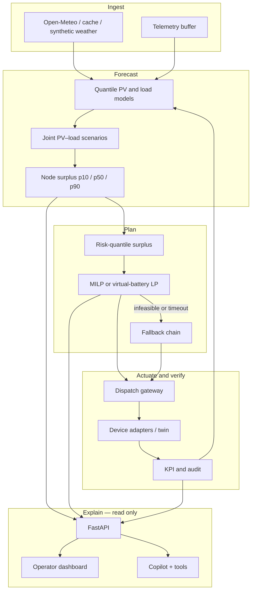
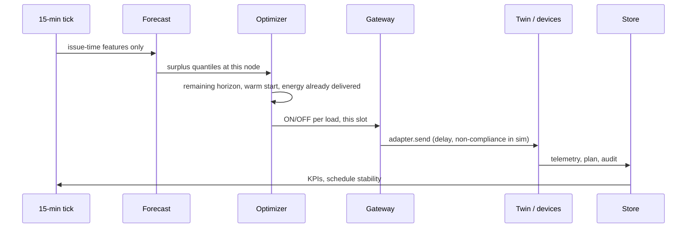

# SolarSponge

**Forecast surplus solar at a node, move flexible demand into that window, verify, and re-plan every 15 minutes.**

SolarSponge is a DISCOM / aggregator control plane for midday curtailment. A probabilistic forecast of *local* unused PV drives a mixed-integer scheduler. Hard operational limits — irrigation energy, cold-room temperature, EV departure SoC, HVAC comfort — are constraints in that scheduler, not penalties the operator hopes hold. An LLM copilot explains plans and runs sandboxed what-ifs. Dispatch authority stays on the optimizer → gateway path.

This repository is the MVP for the Yuva Yodha Energy Tech Hackathon 2026 (Grid Reliability): a **calibrated digital twin of one curtailment zone**, a closed-loop planner, an operator API, and a replay dashboard. Impact figures in `artifacts/` are twin results for a given `config_hash`.

---

## Architecture

The runtime is a modular monolith. One process owns the 15-minute cycle; FastAPI, the copilot, and the Next.js UI are views over the same store.



Separation of authority is the load-bearing design choice ([ADR 0001](docs/adr/0001-optimizer-not-rl.md)):

| Path | May change a load |
|---|---|
| Optimizer → dispatch gateway → adapter | Yes |
| Copilot, what-if API, farmer notice drafts | No |

### Repository layout

| Path | Role |
|---|---|
| `config/default.yaml` | Master configuration (Pydantic-validated). Every plan stores `config_hash`. |
| `config/scenarios/` | Evaluation policies S0–S5 (baseline, oracle, p50, risk MILP, greedy, naive noon). |
| `src/solarsponge/twin/` | One-zone digital twin: PV, baseline load, pumps, cold store, EV depot, HVAC. |
| `src/solarsponge/forecasting/` | Features with issue-time leakage guards, quantile models, surplus sampling. |
| `src/solarsponge/optimizer/` | MILP, virtual-battery LP, greedy / default fallbacks, validation gate. |
| `src/solarsponge/loop.py` | Closed loop: forecast → plan → dispatch → verify; optional rolling re-plan. |
| `src/solarsponge/dispatch/` | Gateway plus simulator; MQTT / OpenADR stubs share the same adapter contract. |
| `src/solarsponge/copilot/` | Read-only tools, actuation refusal, plan-id cache. |
| `src/solarsponge/api/` | HTTP / WebSocket surface, auth, rate limit, kill switch, scheduler tick. |
| `web/` | Operator UI (overview, schedule, forecast, KPIs, what-if, copilot, farmer). |
| `docs/` | ADRs, schema, demo script, application write-up. |

---

## Control loop

Slot length is 15 minutes (configurable). Horizon is 24 hours (96 slots).



On each tick the planner:

1. Builds a surplus trajectory at the **evacuation-limited node**:  
   `surplus = max(0, PV − baseline − flex − evac_limit)`. Absorption only counts at that node.
2. Interpolates p10 / p50 / p90 to `optimizer.risk_quantile` (default 0.4) so the schedule is slightly conservative ([ADR 0002](docs/adr/0002-quantile-forecasts.md)).
3. Solves the remaining horizon. Windows and energy quotas are sliced by energy already delivered; the previous ON matrix is shifted as a warm start.
4. Dispatches only the current slot through the gateway. A kill switch forces the default farmer / facility schedule.
5. Validates windows, min-run, max-starts, and absorbed energy before the plan is stored.

`solarsponge serve --tick` runs this on APScheduler. `build_demo` produces a deterministic one-day replay for the dashboard.

---

## Forecasting

Models emit **p10 / p50 / p90** for PV and baseline load, then surplus quantiles from joint PV–load scenario samples (the object the scheduler actually consumes).

- Features: hour-of-day Fourier terms, calendar, forecast GHI / cloud / temperature, clear-sky index, lagged PV and load known **at issue time**.
- Backends: LightGBM quantile regression when installed; otherwise slot-of-day empirical quantiles. Conformal residuals widen the bands.
- Persistence: `artifacts/models/quantile_model.json` plus an optional parquet feature store.
- Neighbor blend: a GNN-style smoother over a peer zone’s quantiles when `ops.peer_zone_ids` is set.

`python -m solarsponge.cli backtest` writes rolling-origin MAE vs persistence (B0) and clear-sky climatology (B1), plus p10–p90 coverage.

---

## Optimizer

Objective: absorb surplus energy, with a small switch penalty and a large shortfall penalty so irrigation / SoC needs surface as slack rather than silent under-delivery.

Hard structure (per flexible load):

- Allowed window
- Minimum run length and maximum starts per day
- Pump clusters: daily energy from ET₀ and a soil-deficit cap
- Cold store / HVAC: temperature band and thermal mass
- EV depot: arrival SoC → target SoC by departure

**Solve path.** Native `cbc` if present, else PuLP’s bundled CBC (`pulp==2.9.0` — 4.x breaks this formulation), else HiGHS (`highspy`) on Apple Silicon where the bundled CBC binary is x86_64. Sequential HiGHS solves reset the global scheduler so later ticks do not return an all-zero incumbent.

**If the MIP is late or invalid:** incumbent → greedy placement in the fattest surplus slots → published default schedule.

**Scale-out path.** Homogeneous pumps can be aggregated into a virtual battery (power / energy envelope LP) and disaggregated by rotation; thermal and EV loads stay discrete MILP.

---

## Dispatch, copilot, and operator UI

The gateway is the only module that calls `DeviceAdapter.send`. The in-process simulator applies delay, a non-compliance probability, and telemetry noise. MQTT and OpenADR adapters implement the same protocol and currently log rather than drive hardware.

The copilot may call `get_plan`, `get_forecast`, `get_kpis`, `diff_plans`, `get_load_info`, and `run_scenario`. `run_scenario` clones the day into a sandbox store (`dispatched: false`). Numeric claims are checked against tool payloads; ungrounded numbers fall back to a template. WhatsApp / voice copy is drafted, not sent.

The dashboard replays a day: PV, evacuation limit, baseline vs sponged curtailment, per-load Gantt, forecast bands, what-if, and a farmer view in English / Hindi / Tamil. Play / pause / speed walk the 96 slots. If the API is down, `web/public/replay.json` still renders the last committed fixture.

```
GET  /healthz
GET  /v1/zones/{id}/forecast|plan/latest|kpis|replay
POST /v1/zones/{id}/plan          # rebuild demo day
POST /v1/zones/{id}/scenario      # sandbox
POST /v1/copilot/chat
POST /v1/ops/kill-switch
WS   /v1/stream/{id}
```

Set `SOLARSPONGE_API_KEY` (or `ops.api_key`) to require `X-API-Key` on everything except `/healthz` and `/metrics`. `ops.api_rate_limit_per_min` is a per-IP token bucket.

---

## Data and configuration

One YAML file is the source of truth: zone geometry, PV nameplate, evacuation limit, load physics, solver limits, copilot models, evaluation size, and the CO₂ factor. Scenarios overlay `risk_quantile` and whether the optimizer is enabled.

| Store | Use |
|---|---|
| In-memory + SQLite | Default local demo (`ops.database_url`) |
| Postgres / Timescale | Compose; schema in `docs/schema.sql` |
| Redis | Optional forecast cache |
| Parquet / JSON | Feature store and weather cache under `artifacts/` and `data/cache/` |

CO₂ avoided uses **0.675 tCO₂/MWh** — CEA *CO₂ Baseline Database for the Indian Power Sector*, Version 22.0 (August 2026), Table S, FY 2025-26 weighted average of the Indian grid including RES and captive, cross-border adjusted. Combined margin in that table is 0.705. Override `economics.grid_emission_factor_t_per_mwh` to use another CEA series.

Load parameters (pump head, thermal mass, tariffs, SoC) are labelled assumptions in `config/default.yaml` until a feeder is calibrated.

---

## Quick start

Python 3.11+ (3.14 is fine). From the repo root:

```bash
python3 -m venv .venv
source .venv/bin/activate
pip install -e ".[dev]"
make test
make demo          # artifacts/replay.json
make serve         # API :8000 — first boot fits the twin, ~15–40s
```

```bash
cd web && npm install && npm run dev    # UI :3000
```

```bash
docker compose up --build               # API, web, Timescale, Redis, Grafana :3001
python -m solarsponge.cli serve --tick  # live 15-minute re-plans
python -m solarsponge.cli eval --quick --out artifacts   # 8 days × 3 seeds
python -m solarsponge.cli eval --full  --out artifacts   # 30 days × 20 seeds
python -m solarsponge.cli backtest
```

Optional extras: `pip install -e ".[ml,llm]"` for LightGBM / pyarrow / Anthropic. Without an API key the copilot stays on templates.

---

## Evaluation

S0–S5 share the same twin and differ only in information and policy. Reports include bootstrap CIs, capture vs oracle, weather-class splits, greedy / p50 / virtual-battery ablations, and sweeps on `evac_limit_frac` and `risk_quantile`.

| ID | Policy |
|---|---|
| S0 | Published default windows, optimizer off |
| S1 | Oracle surplus (upper bound on this twin) |
| S2 | p50 surplus + MILP |
| S3 | Risk quantile + MILP (default product) |
| S4 | Greedy heuristic |
| S5 | Naive noon stacking |

`make eval` regenerates `artifacts/eval.md`. Quote those tables as **twin results for this config**, with the hash printed in the file.

---

## Scope of this prototype

The twin is one illustrative Rajasthan-like feeder (nameplate and evacuation limit in config), four flexible-load classes, and simulated device behaviour. National curtailment statistics in `docs/application.md` are problem context. A field pilot still needs a DISCOM data room, an incentive tariff, and certified adapters.

Solver pin: **pulp==2.9.0**. A `cbc` binary on `PATH` is preferred; otherwise HiGHS.

---

## License

Hackathon prototype. See `docs/` for the demo script, ADRs, and application text.
